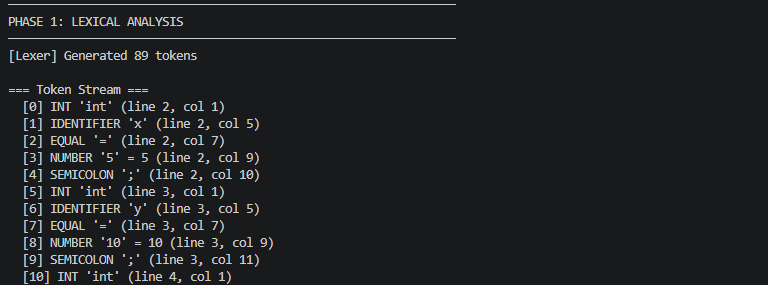
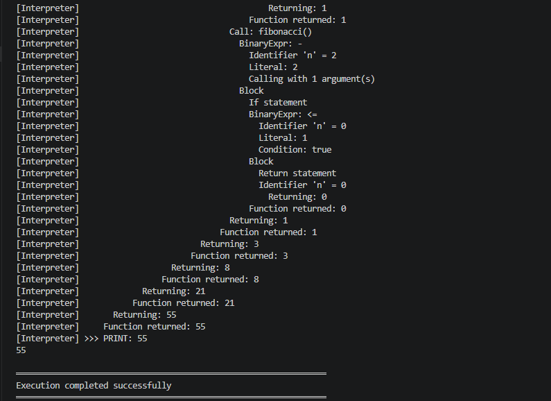
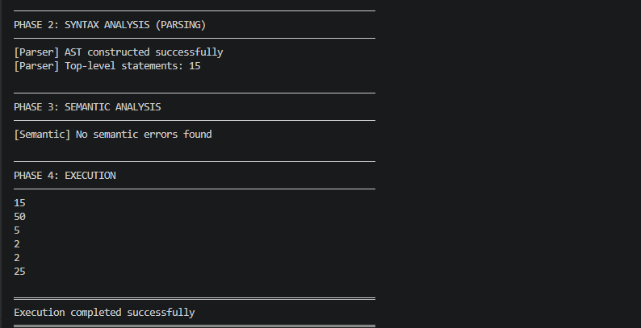

# Forge

Forge is a Java-like language engine built from scratch in Java that implements the major phases of a compiler and interpreter pipeline. The project supports lexical analysis, recursive descent parsing, semantic analysis, Abstract Syntax Tree (AST) construction, and execution through an AST-based interpreter.

## Features

- Lexical analysis and token generation
- Recursive descent parser
- Abstract Syntax Tree (AST) construction
- Semantic analysis using scoped symbol tables
- Variable declarations and assignments
- Arithmetic and comparison operators
- Conditional statements (if / else)
- While loops
- Functions with parameters and return values
- Recursive function calls
- Nested scopes and variable shadowing
- Execution trace mode for debugging and visualization

## Architecture

```text
Source Code
    ↓
Lexer
    ↓
Token Stream
    ↓
Parser
    ↓
Abstract Syntax Tree (AST)
    ↓
Semantic Analyzer
    ↓
Interpreter
    ↓
Program Output
```

## Tech Stack

- Java
- Maven
- Object-Oriented Design
- Visitor Pattern
- Recursive Descent Parsing

## Supported Language Constructs

```java
int x = 10;

int factorial(int n) {
    if (n <= 1) {
        return 1;
    }
    return n * factorial(n - 1);
}

print(factorial(5));
```

## Screenshots

### Lexical Analysis



### Execution Trace



### Compiler Pipeline



## Example Programs

The repository includes sample programs demonstrating:

- Arithmetic expressions
- Variable assignments
- Control flow statements
- Function definitions
- Recursive algorithms
- Nested scopes and shadowing
- Fibonacci and factorial computation

## Challenges Solved

During development and testing:

- Added support for single-line comments in the lexer
- Fixed function body parsing in the recursive descent parser
- Corrected scope resolution to allow variable shadowing in nested blocks
- Validated recursion support using factorial and fibonacci implementations

## Build and Run

```bash
mvn clean package

java -jar target/forge-1.0.0.jar examples/example1.mjx

java -jar target/forge-1.0.0.jar examples/example3.mjx --trace

java -jar target/forge-1.0.0.jar examples/example1.mjx --tokens
```